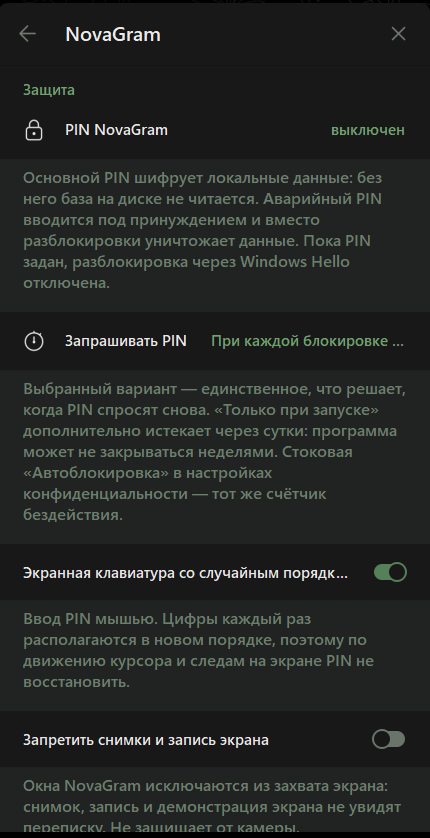
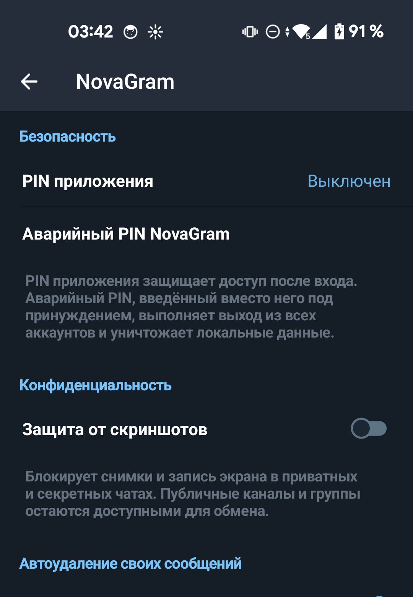
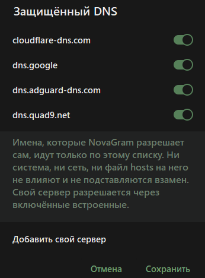
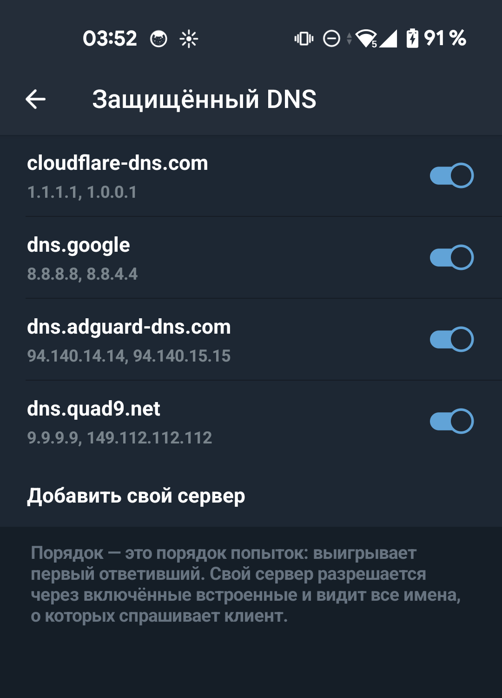

# NovaGram — форк Telegram с упором на приватность для Windows и Android

Форк Telegram, который защищает не переписку в канале связи, а само устройство:
что лежит на диске, что видно на экране, что клиент рассказывает о себе по своей
инициативе и что произойдёт, если телефон или ноутбук окажется в чужих руках вместе
с владельцем.

- **Аварийный PIN.** Второй PIN, который не разблокирует программу, а выходит из
  всех аккаунтов, удаляет локальные данные и включает заглушку. Со стороны
  неотличим от обычной разблокировки.
- **Режим заглушки.** После уничтожения на экране обычный на вид Telegram с чужим
  аккаунтом и читаемыми переписками — и настоящие имя и номер владельца, чтобы
  сошлось с SIM.
- **PIN шифрует `tdata` на ПК.** Из PIN выводится ключ, которым перешифровывается
  локальный ключ Telegram: скопированная папка на другом компьютере не открывается.
- **Строгий DNS-over-HTTPS.** Апстримная цепочка Google → Mozilla → Firebase →
  системный резолвер заменена четырьмя зашитыми эндпоинтами.
- **Окна не попадают в запись экрана** (Windows), **автоудаление своих сообщений**
  по таймеру, **скрытие квитанции о прочтении** в диалогах, начатых незнакомцем.

| Windows | Android |
| :---: | :---: |
|  |  |
|  |  |

<sub>Сверху — раздел «NovaGram» в настройках, снизу — список эндпоинтов защищённого
DNS: те самые четыре адреса, мимо которых имена не разрешаются.</sub>

## Скачать

[](https://github.com/confeden/Novagram/releases/latest)

Все файлы — на странице [Releases](https://github.com/confeden/Novagram/releases/latest).

| Платформа | Файл | Требования |
| --- | --- | --- |
| Windows | `NovaGramSetup-<версия>-x64.exe` | Windows 10; полное исключение из захвата экрана — с версии 2004 |
| Android | `NovaGram-<версия>-release.apk` | Android 6.0 и новее; один APK на все архитектуры (arm64, arm32, x86, x86_64) |

Запуском проверялись Windows 10/11 и Android 9 и новее. Магазинов приложений нет,
APK ставится вручную.

## Статус разработки

Метки в таблицах ниже — состояние функции из рабочего плана проекта

- `Проверено` — запущено на реальном аккаунте или устройстве и дало ожидаемый
  результат. Не «собралось», а именно прогнано руками.
- `Собрано` — код написан и собирается, запуском не проверено.
- `Основа` — хранилище и контракты готовы, функция не активна.
- `Ограничено` — платформа или Telegram API не дают сделать задуманное целиком.
- `Запланировано` — требования есть, кода нет.
- `Отклонено` — сделано не будет, причина названа.

## Как проверить, что здесь написана правда

Исходный код обеих платформ лежит в отдельных репозиториях, и каждый из них GitHub
считает форком официального клиента — с пометкой «forked from» и кнопкой сравнения.
Всё, что NovaGram добавляет, собрано в один коммит поверх официального тега, поэтому
разница открывается одной ссылкой и читается построчно:

- **ПК:** [сравнение с Telegram Desktop](https://github.com/telegramdesktop/tdesktop/compare/v7.0.9...confeden:novagram-desktop:novagram/v7.0.9)
- **Android:** [сравнение с Telegram Android](https://github.com/DrKLO/Telegram/compare/45ab8f43...confeden:novagram-android:novagram/v12.9.2)

**Какому выпуску соответствует снимок.** Опубликованные ветки сравнения отвечают
первому выпуску `v7.0.9/12.9.2`. Всё, что добавлено после него — видимая система
обновления, обезличенные имена файлов, очистка метаданных отправляемых изображений и
строгий DoH, — в снимок ещё **не вошло**; ветки пересобираются к очередному выпуску.
Пока это так, по ссылкам сверху нельзя проверить именно тот бинарник, что лежит в
Releases, — и об этом честнее написать, чем промолчать.

## Привязка к оригиналу

Обе базы обязаны быть последними официально опубликованными, и это не дисциплина, а
шлюз: `scripts/check-upstream.ps1` вызывается первой строкой каждой сборки и
останавливает её, если апстрим новее. Сетевая проверка кэшируется на сутки,
принудительно — ключом `-Force`. Подробности в
[`UPSTREAM_POLICY.md`](UPSTREAM_POLICY.md).

Базы текущего выпуска: Telegram Desktop `v7.0.9` (Windows) и Telegram for Android
`12.9.2 (6991)`. Релиз один на обе платформы, и тег несёт обе базы:
`v<база ПК>/<база Android>`. Клиент сравнивает только свою половину.

## Сборка из исходников

Обе платформы требуют собственных `api_id`/`api_hash` Telegram — они читаются из
локального файла окружения и в репозиторий не попадают. Android собирается с
`minSdkVersion 23`; нативная часть строится с `ANDROID_PLATFORM=android-21`.

```powershell
.\scripts\build-desktop.ps1 -Config Release   # ПК
.\scripts\build-android.ps1                   # Android
.\scripts\check-upstream.ps1 -Project All -Force
```

Версии инструментов, ловушки сборки и подписывание — в [`docs/build.md`](docs/build.md).

## Документация

- [`docs/internals.md`](docs/internals.md) — устройство форка: привязка к базе, где
  что лежит и чем зашифровано, как отрезана сеть в заглушке, точки вставки.
- [`docs/upstream-baseline.md`](docs/upstream-baseline.md) — что официальный Telegram
  оставляет на устройстве и какие его слабости форк не закрывает, со ссылками на код.
- [`UPSTREAM_POLICY.md`](UPSTREAM_POLICY.md) — привязка к официальному апстриму и как
  она проверяется.
- [`docs/build.md`](docs/build.md) — сборка, зафиксированные версии, подписывание.
- [`docs/doh.md`](docs/doh.md) — устройство защищённого DNS, список и правила его правки.
- [`docs/calls.md`](docs/calls.md) — звонки: relay-only, адреса, границы.
- [`docs/privacy.md`](docs/privacy.md) — что отключено из телеметрии и какой служебный
  трафик сохранён намеренно.
- [`docs/privacy-push.md`](docs/privacy-push.md) — что уходит в push и что о нём знает
  посредник.
- [`docs/peer-id.md`](docs/peer-id.md) — идентификаторы пиров: что разрешимо, а что нет.
- [`docs/verify-read-status.md`](docs/verify-read-status.md) — как проверять скрытие
  статуса прочтения.
- [`docs/upstream-sync.md`](docs/upstream-sync.md) — порядок слияния с официальными
  репозиториями.

## Лицензия и правовая информация

NovaGram — производная работа от официальных клиентов Telegram и распространяется на
их условиях: часть для ПК — **GNU GPL v3** с исключением для OpenSSL, часть для
Android — **GNU GPL v2**. Авторские права на исходный код Telegram принадлежат его
авторам.

NovaGram — независимый форк. Проект не связан с Telegram Messenger Inc., не одобрен
ею и не представляет её. Клиент работает с серверами Telegram и подчиняется их
условиям использования и Telegram API Terms of Service; сборка использует собственные
`api_id`/`api_hash`, и ответственность за их получение и соблюдение условий лежит на
том, кто собирает. Программа поставляется как есть, без каких-либо гарантий.

---

⬇️ **[Скачать последний выпуск](https://github.com/confeden/Novagram/releases/latest)** —
Windows `NovaGramSetup-<версия>-x64.exe`, Android `NovaGram-<версия>-release.apk`.

🙋 **Группа в Телеграм:** [@nova_txt](https://t.me/nova_txt) — вопросы, новости,
поддержка.

☕ **[Отблагодарить](https://nova-app.eu/donate)** — необязательный способ сказать
«спасибо», если NovaGram оказался полезен.
